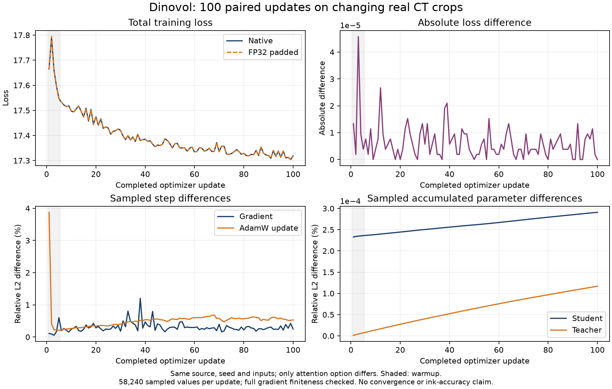

# 100 paired updates with changing CT crops and masks

This extends the same experimental attention contribution. It is not a new
attention algorithm, separate prize entry, convergence test or ink-quality result.

Both arms completed 100 actual updates on the same verified integrated source,
with identical starting sampled parameters and all 100 matching batch hashes.
The only model configuration difference is pad_sdpa_heads false/true.
There is no runtime attention substitution or checkpoint compatibility adapter.

| Measurement | Result |
|---|---|
| Native / candidate median timed step | 3070.23 / 2657.93 ms |
| Median step speedup | 1.155x |
| Peak allocated memory reduction | 15.75% |
| Worst sampled gradient relative L2 difference | 1.2039% at update index 37 |
| Worst sampled AdamW update relative L2 difference | 3.8747% at update index 0 |
| Final sampled student / teacher parameter relative L2 difference | 0.000291% / 0.000117% |
| Maximum absolute total-loss difference | 4.57763672e-05 |

Update indices in the evidence are zero-based. The plot uses completed-update
numbers 1-100. These differences are measured, not accepted quality tolerances.
Both arms can drift or be inaccurate while their training losses stay similar.
The candidate remains experimental and disabled by default.
This is one seeded pair on two CT regions and one environment. No repeated-native
control was run to estimate background numerical variability. The reported
differences describe these two executions, not a general error bound.



## Protocol and evidence

Full 864-wide, 24-block backbone, 313,254,496 student parameters and 131072-output
DINO/iBOT heads; fresh seeded heads/AdamW/scaler and the official pretrained
ps8 step352500 teacher backbone. PHerc0139 A/B256 fixtures at 9.362um. B2,
two 96-cubed global views and eight 64-cubed local views per sample. Each update
uses new deterministic uniform view origins and 25% token masks in two global
views. No other image augmentation. See [the pre-result plan](../TRAJECTORY_PLAN.md).

Five warmups plus 95 timed updates per arm. Timing includes the official step's
copies, losses, backward, AdamW and EMA; excludes setup, crop generation and
audits. GPU is the existing Windows RTX 3090. GPU processes ran sequentially.

Every full gradient was checked for finite values at every update, every
optimizer parameter step was checked, and all recorded checks passed. Full
parameter/gradient/EMA audits ran at indices 0, 24, 49, 74, 99. Intervening audits
used 128 equally spaced values per parameter (58,240 total), with sampled
student/teacher changes and sampled EMA checks. Full audit norms and sampled
audit norms must not be treated as the same quantity.

Raw step receipts: [native](native/report.json), [padded](padded/report.json).
[Comparison](comparison.json) includes every paired loss and sampled difference,
input-match checks, report hashes, and hashes of local unbundled sample files.
Gradient/update arrays for the first, last, and worst steps are included. Model
weights, CT and most raw sample arrays remain unbundled. Reproduce to regenerate
them. The reports contain declared nonsensitive local execution paths.

## Reproduce

First [assemble the pinned source](../../integrated_source/ASSEMBLY.md) and obtain
the verified checkpoint and A/B fixtures described in the main README and input
receipts. Use fresh output folders and run GPU arms separately. Run from the
repository root; substitute your absolute paths:

```text
python research/training/trajectory_audit.py
python research/training/run_trajectory_probe.py --dinovol-root /path/to/assembly/dinovol --integrated-manifest /path/to/assembly/ASSEMBLY_MANIFEST.json --checkpoint /path/to/teacher.pt --volumes /path/to/A256.npy /path/to/B256.npy --mode native --output /path/to/native --steps 95 --warmups 5 --global-size 96 --recipe representative --gpu-memory-fraction 0.95 --audit-every 25 --vary-views
```

Repeat the same command with --mode padded and a different output directory.

```text
python research/training/compare_trajectory.py /path/to/native /path/to/padded --output /path/to/comparison.json
python research/training/plot_trajectory.py /path/to/comparison.json --output /path/to/trajectory.png
```
